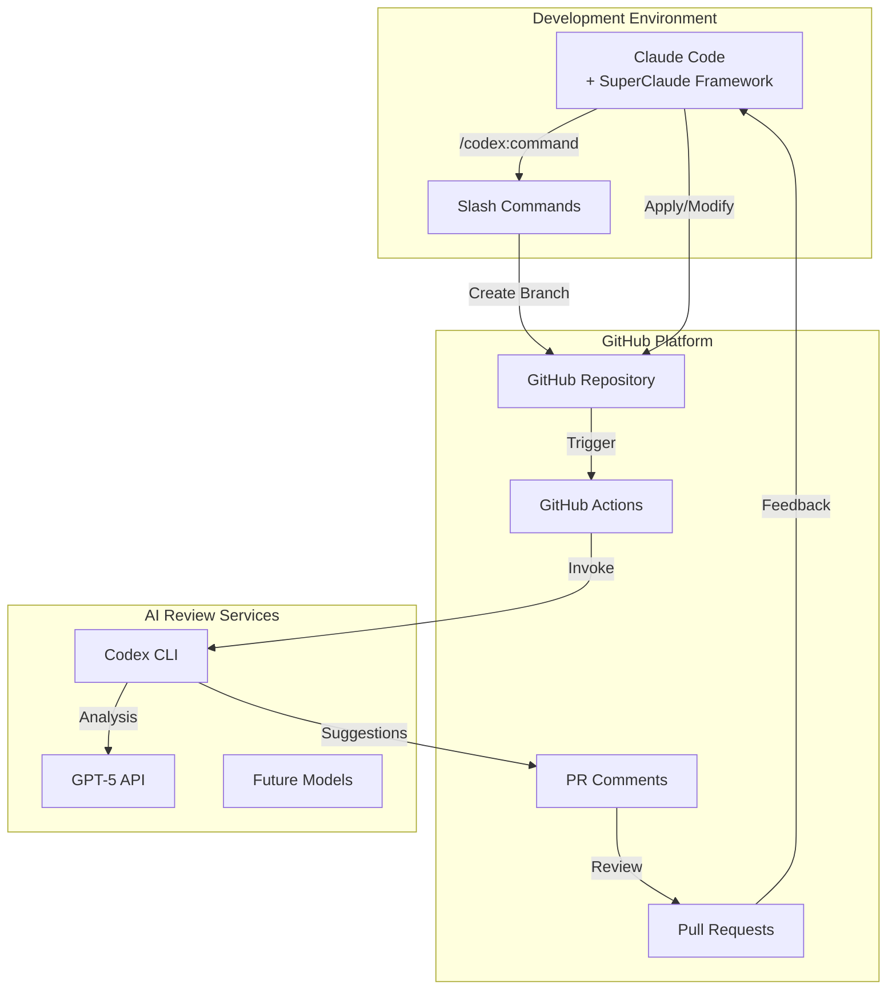

# Claude Code × OpenAI Codex 協業システム設計書

## 1. 概要

### 1.1 プロジェクト概要
Claude CodeとOpenAI Codex CLIを連携させ、複数のAIモデルによる協調的なコード開発・レビューシステムを構築する。GitHub経由で実際のチーム開発パターンを模倣し、各AIの強みを活かした開発フローを実現する。

### 1.2 目的
- **多様な視点**: 異なるAIモデルからの提案により、より良いコード品質を実現
- **安全な協業**: 直接的なコード書き換えを避け、PR/レビュー形式での提案
- **自動化**: GitHub Actions/Workflowsによる自動化された協業フロー
- **オープンソース**: コミュニティによる拡張可能な設計

### 1.3 主要コンポーネント
```
┌─────────────┐     ┌─────────┐     ┌──────────────┐
│Claude Code  │────▶│ GitHub  │◀────│OpenAI Codex  │
│(Primary Dev)│     │(Workflow)│     │(Review/Advice)│
└─────────────┘     └─────────┘     └──────────────┘
        │                │                    │
        └────────────────┴────────────────────┘
              Collaborative Development
```

## 2. アーキテクチャ設計

### 2.1 システム構成図



### 2.2 データフロー

```yaml
workflow:
  1_initiate:
    actor: User
    action: "/codex:refactoring --scope module"
    target: Claude Code

  2_branch_creation:
    actor: Claude Code
    action: Create feature branch
    target: GitHub
    branch: "codex-review/refactor-{timestamp}"

  3_pr_creation:
    actor: Claude Code
    action: Open Pull Request
    metadata:
      title: "🤖 Codex Review Request"
      labels: ["codex-review", "automated"]

  4_analysis:
    actor: GitHub Actions
    trigger: PR opened/updated
    action: Invoke Codex CLI

  5_review:
    actor: Codex CLI
    action: Analyze code changes
    output: Suggestions as PR comments

  6_feedback:
    actor: Claude Code
    action: Present suggestions to user
    format: Interactive selection

  7_resolution:
    actor: Claude Code
    action: Apply selected suggestions
    result: Merge or iterate
```

## 3. 機能仕様

### 3.1 スラッシュコマンド

| コマンド | 説明 | パラメータ |
|---------|------|-----------|
| `/codex:refactoring` | リファクタリング提案を要求 | `--scope [file\|function\|module]`<br/>`--focus [performance\|readability\|patterns]` |
| `/codex:review` | 現在の変更をレビュー | `--depth [quick\|thorough\|security]` |
| `/codex:suggest` | 特定問題の代替実装提案 | `--problem <description>`<br/>`--constraints <list>` |
| `/codex:compare` | 複数AIモデルの提案比較 | `--models [gpt5\|claude\|local]` |

### 3.2 GitHub Workflow仕様

#### 3.2.1 PR自動レビューワークフロー
```yaml
# .github/workflows/codex-review.yml
name: Codex AI Review
on:
  pull_request:
    types: [opened, synchronize]
    branches:
      - 'codex-review/*'
    paths:
      - '**.js'
      - '**.ts'
      - '**.py'
      - '**.java'

jobs:
  codex-analysis:
    runs-on: ubuntu-latest
    permissions:
      contents: read
      pull-requests: write

    steps:
      - name: Checkout PR
        uses: actions/checkout@v4
        with:
          fetch-depth: 0

      - name: Setup Codex CLI
        uses: openai/setup-codex-cli@v1
        with:
          api-key: ${{ secrets.OPENAI_API_KEY }}

      - name: Analyze Changes
        id: analyze
        run: |
          codex-cli analyze \
            --base ${{ github.event.pull_request.base.sha }} \
            --head ${{ github.sha }} \
            --format json \
            --output analysis.json

      - name: Post Review Comments
        uses: ./.github/actions/post-codex-review
        with:
          analysis-file: analysis.json
          pr-number: ${{ github.event.pull_request.number }}
          github-token: ${{ secrets.GITHUB_TOKEN }}
```

#### 3.2.2 提案フォーマット
```typescript
interface CodexSuggestion {
  type: 'refactoring' | 'optimization' | 'security' | 'style';
  severity: 'info' | 'warning' | 'error';
  file: string;
  line_start: number;
  line_end: number;
  original_code: string;
  suggested_code: string;
  explanation: string;
  impact: {
    risk: 'low' | 'medium' | 'high';
    performance: 'positive' | 'neutral' | 'negative';
    readability: 'improved' | 'unchanged' | 'degraded';
  };
  confidence: number; // 0.0 - 1.0
}
```

### 3.3 PR コメントフォーマット

```markdown
## 🤖 Codex Analysis Result

### 📊 Summary
- **Total Suggestions**: 5
- **High Priority**: 2
- **Medium Priority**: 2
- **Low Priority**: 1

### 💡 Suggestion #1: Improve Error Handling
**File**: `src/auth/login.js:45-52`
**Severity**: ⚠️ Warning
**Confidence**: 85%

#### Current Code:
\`\`\`javascript
const user = authenticate(credentials);
return user;
\`\`\`

#### Suggested Code:
\`\`\`suggestion
try {
  const user = await authenticate(credentials);
  if (!user) {
    throw new Error('Authentication failed');
  }
  return { success: true, user };
} catch (error) {
  logger.error('Authentication failed:', error);
  return { success: false, error: error.message };
}
\`\`\`

#### Explanation:
- ✅ **Improvement**: Proper error handling and logging
- 📈 **Performance Impact**: Neutral
- 🛡️ **Security**: Prevents unhandled promise rejections
- 📖 **Readability**: Improved with explicit error cases

#### Impact Assessment:
- **Risk Level**: 🟢 Low - Safe improvement
- **Breaking Changes**: None
- **Test Coverage**: Existing tests compatible

---

[Accept Suggestion] [Modify] [Dismiss]
```

## 4. セキュリティ設計

### 4.1 アクセス制御

```yaml
security:
  api_keys:
    storage: GitHub Secrets
    rotation: Monthly
    access:
      - OPENAI_API_KEY: Encrypted
      - GITHUB_TOKEN: Repository scoped

  permissions:
    codex:
      read: true
      suggest: true
      direct_write: false  # 直接書き換え禁止
      branch_operations: true

    claude:
      read: true
      write: true
      merge: true
      admin: false

  review_gates:
    automated_checks:
      - syntax_validation: required
      - test_pass: required
      - security_scan: required
    manual_approval:
      - user_confirmation: required_for_merge
      - override_option: available
```

### 4.2 データ保護

```yaml
data_protection:
  sensitive_data:
    - credentials: Never included in PR
    - api_keys: Masked in logs
    - user_data: Anonymized in analysis

  retention:
    pr_comments: 90_days
    analysis_logs: 30_days
    temporary_branches: 7_days_after_merge
```

## 5. 実装ロードマップ

### Phase 1: 基礎インフラ構築（Week 1-2）

```
colab-claude-codex/
├── .github/
│   ├── workflows/
│   │   ├── codex-review.yml
│   │   ├── merge-consensus.yml
│   │   └── cleanup.yml
│   ├── actions/
│   │   ├── post-codex-review/
│   │   │   ├── action.yml
│   │   │   └── index.js
│   │   └── suggestion-processor/
│   │       ├── action.yml
│   │       └── index.js
│   └── CODEOWNERS
├── src/
│   ├── claude-extensions/
│   │   ├── slash-commands.ts
│   │   ├── command-parser.ts
│   │   └── github-client.ts
│   ├── codex-integration/
│   │   ├── review-client.ts
│   │   ├── suggestion-formatter.ts
│   │   └── api-wrapper.ts
│   └── shared/
│       ├── types.ts
│       └── utils.ts
├── config/
│   ├── ai-models.yaml
│   ├── review-rules.yaml
│   └── security-policies.yaml
├── tests/
│   ├── integration/
│   └── unit/
├── docs/
│   ├── API.md
│   ├── SETUP.md
│   └── CONTRIBUTING.md
├── package.json
├── tsconfig.json
└── README.md
```

### Phase 2: コア機能実装（Week 3-4）

#### 主要実装タスク
1. **Slash Command Handler**
   ```typescript
   // src/claude-extensions/slash-commands.ts
   export class CodexCommandHandler {
     async execute(command: string, args: CommandArgs): Promise<CommandResult> {
       const parser = new CommandParser();
       const parsed = parser.parse(command, args);

       switch(parsed.command) {
         case 'refactoring':
           return this.handleRefactoring(parsed.options);
         case 'review':
           return this.handleReview(parsed.options);
         case 'suggest':
           return this.handleSuggestion(parsed.options);
         default:
           throw new Error(`Unknown command: ${parsed.command}`);
       }
     }
   }
   ```

2. **GitHub Integration**
   ```typescript
   // src/claude-extensions/github-client.ts
   export class GitHubIntegration {
     async createReviewPR(options: PROptions): Promise<PullRequest> {
       const branch = await this.createBranch(options.branchName);
       await this.pushChanges(branch);

       const pr = await this.octokit.pulls.create({
         owner: this.owner,
         repo: this.repo,
         title: options.title,
         head: branch,
         base: options.baseBranch || 'main',
         body: this.generatePRBody(options),
         labels: ['codex-review', 'automated']
       });

       return pr.data;
     }
   }
   ```

### Phase 3: 高度な機能（Week 5-6）

- **Multi-Model Support**: 複数AIモデルの並列レビュー
- **Consensus Algorithm**: 複数提案の調整アルゴリズム
- **Learning System**: 過去のレビュー履歴から学習
- **Custom Rules**: プロジェクト固有のレビュールール

### Phase 4: オープンソース準備（Week 7-8）

- **Documentation**: 包括的なドキュメント作成
- **Example Projects**: サンプルプロジェクトの準備
- **CI/CD Pipeline**: 自動テスト・デプロイメント
- **Community Guidelines**: コントリビューションガイドライン

## 6. 使用例

### 6.1 基本的なリファクタリングフロー

```bash
# 1. Claude Codeで開発中
User: "認証システムを実装して"
Claude: "実装しました。"

# 2. Codexレビューを要求
User: "/codex:refactoring --scope module --focus readability"
Claude: "Codexレビューを開始します..."

# 3. 自動処理
- Branch作成: codex-review/auth-refactor-1234567
- PR作成: #123 "🤖 Codex Review: Auth Module Refactoring"
- Codex分析実行
- 提案をPRコメントとして投稿

# 4. インタラクティブな選択
Claude: "以下の提案を受けました：
  1. ✅ 関数の分割 (リスク: Low)
  2. ⚠️ エラーハンドリングの改善 (リスク: Medium)
  3. ✅ 型定義の追加 (リスク: Low)

  どの提案を適用しますか？"

User: "1と3を適用"

# 5. 適用とマージ
Claude: "選択された提案を適用しています..."
- 提案の適用
- テスト実行
- PR自動マージ
```

### 6.2 複雑なレビューシナリオ

```typescript
// セキュリティ重視のレビュー
User: "/codex:review --depth security"

// 複数モデルの比較
User: "/codex:compare --models gpt5,claude --problem 'optimize database queries'"

// カスタム制約付き提案
User: "/codex:suggest --problem 'slow API response' --constraints 'no external dependencies,maintain backward compatibility'"
```

## 7. 拡張性

### 7.1 新しいAIモデルの追加

```yaml
# config/ai-models.yaml
models:
  gpt5:
    provider: openai
    endpoint: https://api.openai.com/v1
    capabilities: [refactoring, optimization, security]

  claude:
    provider: anthropic
    endpoint: https://api.anthropic.com/v1
    capabilities: [reasoning, architecture, documentation]

  local-llm:  # 将来の拡張
    provider: local
    endpoint: http://localhost:8080
    capabilities: [quick-review, syntax-check]
```

### 7.2 プラグインシステム

```typescript
// Plugin Interface
export interface CodexPlugin {
  name: string;
  version: string;
  analyze(code: string, context: AnalysisContext): Promise<Suggestion[]>;
  format(suggestion: Suggestion): string;
}

// Custom Plugin Example
export class SecurityPlugin implements CodexPlugin {
  name = 'security-scanner';
  version = '1.0.0';

  async analyze(code: string, context: AnalysisContext) {
    // Custom security analysis logic
    return suggestions;
  }
}
```

## 8. パフォーマンス最適化

### 8.1 並列処理

```yaml
optimization:
  parallel_analysis:
    max_concurrent_files: 10
    batch_size: 50

  caching:
    analysis_results: 1_hour
    model_responses: 30_minutes

  rate_limiting:
    api_calls_per_minute: 60
    retry_strategy: exponential_backoff
```

### 8.2 リソース管理

```typescript
// Resource Management
class ResourceManager {
  private readonly maxConcurrent = 5;
  private readonly queue: AnalysisTask[] = [];

  async scheduleAnalysis(task: AnalysisTask) {
    if (this.running < this.maxConcurrent) {
      return this.executeTask(task);
    }
    return this.queueTask(task);
  }
}
```

## 9. モニタリングとメトリクス

### 9.1 追跡メトリクス

```yaml
metrics:
  usage:
    - total_reviews_requested
    - suggestions_accepted_rate
    - average_review_time

  quality:
    - false_positive_rate
    - suggestion_accuracy
    - user_satisfaction_score

  performance:
    - api_response_time
    - github_action_duration
    - cache_hit_rate
```

### 9.2 ダッシュボード

```typescript
// Metrics Dashboard Data
interface DashboardMetrics {
  daily_stats: {
    reviews: number;
    suggestions: number;
    accepted: number;
    rejected: number;
  };

  model_performance: {
    [model: string]: {
      accuracy: number;
      response_time: number;
      cost: number;
    };
  };

  user_feedback: {
    satisfaction: number;
    most_useful_features: string[];
    improvement_requests: string[];
  };
}
```

## 10. トラブルシューティング

### 10.1 一般的な問題と解決策

| 問題 | 原因 | 解決策 |
|-----|------|--------|
| PRが作成されない | 権限不足 | GitHub token権限を確認 |
| Codex応答なし | API制限 | レート制限を確認、リトライ実装 |
| 提案が不適切 | コンテキスト不足 | より詳細なコンテキストを提供 |
| マージ競合 | 並行編集 | 自動リベース機能を実装 |

### 10.2 デバッグモード

```bash
# Enable debug logging
export CODEX_DEBUG=true
export LOG_LEVEL=verbose

# Test specific command
claude-code --debug "/codex:refactoring --dry-run"
```

## 11. ライセンスとコントリビューション

### 11.1 ライセンス
- MIT License
- オープンソースとして公開
- 商用利用可能

### 11.2 コントリビューションガイドライン
- Pull Request テンプレート
- コーディング規約
- テスト要件
- ドキュメント更新

## 12. 今後の展望

### 12.1 短期目標（3ヶ月）
- ✅ 基本的なGitHub統合
- ✅ Codexレビュー機能
- ⏳ マルチモデルサポート
- ⏳ プラグインシステム

### 12.2 長期目標（1年）
- 🎯 AI間の自律的な協調
- 🎯 学習型レビューシステム
- 🎯 エンタープライズ対応
- 🎯 IDE統合（VS Code, IntelliJ）

---

## 付録A: API仕様

[別ドキュメント参照: API.md]

## 付録B: セットアップガイド

[別ドキュメント参照: SETUP.md]

## 付録C: コントリビューションガイド

[別ドキュメント参照: CONTRIBUTING.md]