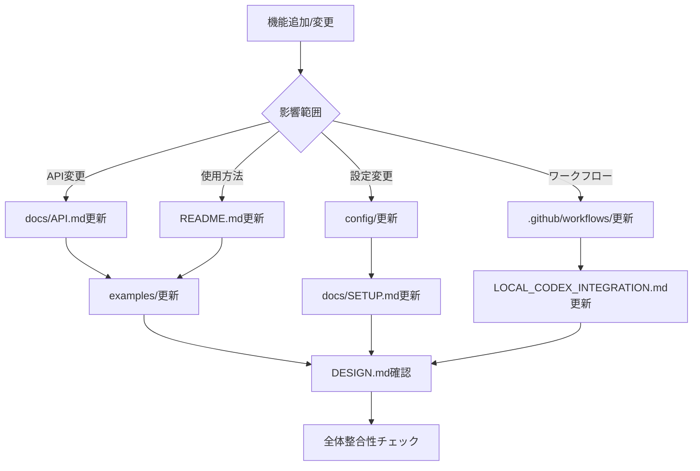

# 📚 Documentation Map

プロジェクトの全ドキュメント構造と相互関係を示すマップです。

## 📁 ドキュメント構造

```
colab_claude_codex/
│
├── 📄 README.md                    [エントリーポイント]
│   ├── → docs/SETUP.md            (セットアップ詳細)
│   ├── → CONTRIBUTING.md          (貢献方法)
│   └── → examples/                (使用例)
│
├── 📄 DESIGN.md                    [システム設計]
│   ├── → docs/API.md              (API仕様)
│   ├── → docs/SETUP.md            (実装詳細)
│   └── → config/                  (設定仕様)
│
├── 📄 LOCAL_CODEX_INTEGRATION.md   [ローカル統合]
│   ├── → package.json             (スクリプト定義)
│   ├── → scripts/                 (実装コード)
│   └── → .codex-config.yml        (設定)
│
├── 📄 DOCUMENTATION_FIXES.md       [修正リスト]
│   └── 整合性問題と修正方針
│
├── 📁 docs/
│   ├── 📄 SETUP.md                [詳細セットアップ]
│   │   ├── → README.md           (概要に戻る)
│   │   ├── → config/             (設定詳細)
│   │   └── → scripts/            (スクリプト説明)
│   │
│   └── 📄 API.md                  [API仕様書]
│       ├── → examples/           (使用例)
│       └── → .github/workflows/  (実装)
│
├── 📁 examples/
│   ├── 📄 example-pr-workflow.md  [PRワークフロー例]
│   └── 📄 slash-commands-demo.md  [コマンド例]
│
├── 📁 config/
│   ├── 📄 ai-models.yaml          [AIモデル設定]
│   ├── 📄 review-rules.yaml       [レビュールール]
│   └── 📄 .codex-config.yml       [Codex設定]
│
├── 📁 .github/
│   └── 📁 workflows/
│       ├── 📄 codex-review.yml    [レビューワークフロー]
│       ├── 📄 codex-hybrid.yml    [ハイブリッドモード]
│       ├── 📄 merge-consensus.yml [自動マージ]
│       └── 📄 cleanup.yml         [クリーンアップ]
│
└── 📁 scripts/
    ├── 📄 local-codex-review.js   [ローカルレビュー]
    └── 📄 push-codex-results.js   [結果投稿]
```

## 🎯 ドキュメントの役割

### 入門・概要
| ドキュメント | 対象読者 | 主な内容 |
|------------|---------|---------|
| README.md | 新規ユーザー | プロジェクト概要、クイックスタート |
| CONTRIBUTING.md | 貢献者 | 貢献方法、コーディング規約 |

### 技術仕様
| ドキュメント | 対象読者 | 主な内容 |
|------------|---------|---------|
| DESIGN.md | 開発者 | システムアーキテクチャ、設計思想 |
| docs/API.md | API利用者 | エンドポイント、データモデル |
| LOCAL_CODEX_INTEGRATION.md | 実装者 | ローカル統合の詳細 |

### セットアップ・設定
| ドキュメント | 対象読者 | 主な内容 |
|------------|---------|---------|
| docs/SETUP.md | 管理者 | 詳細なインストール手順 |
| config/*.yaml | 設定担当者 | 各種設定オプション |
| .codex-config.example.yml | ユーザー | 設定テンプレート |

### 実装・コード
| ドキュメント | 対象読者 | 主な内容 |
|------------|---------|---------|
| .github/workflows/*.yml | DevOps | CI/CD設定 |
| scripts/*.js | 開発者 | 実行可能スクリプト |
| package.json | 開発者 | 依存関係、スクリプト定義 |

### 例・デモ
| ドキュメント | 対象読者 | 主な内容 |
|------------|---------|---------|
| examples/*.md | ユーザー | 実践的な使用例 |

## 🔄 ドキュメント更新フロー



## ✅ チェックリスト

### 新機能追加時
- [ ] README.mdに概要追加
- [ ] docs/API.mdにAPI仕様追加（該当する場合）
- [ ] docs/SETUP.mdにセットアップ手順追加
- [ ] examples/に使用例追加
- [ ] config/に設定追加（必要な場合）
- [ ] DESIGN.mdの更新検討

### バグ修正時
- [ ] 関連ドキュメントの誤りを修正
- [ ] examples/の更新（該当する場合）

### 設定変更時
- [ ] config/の該当ファイル更新
- [ ] .codex-config.example.yml更新
- [ ] docs/SETUP.md更新
- [ ] README.mdのクイックスタート確認

## 📊 現在の状態（2024年1月）

### ✅ 完成度が高い
- README.md (90%)
- CONTRIBUTING.md (95%)
- docs/SETUP.md (85%)
- LOCAL_CODEX_INTEGRATION.md (90%)

### ⚠️ 改善が必要
- DESIGN.md (70%) - GPT-5参照など古い情報
- docs/API.md (75%) - 実装と乖離
- config/ai-models.yaml (60%) - 廃止モデル参照

### 🔴 要注意
- examples/ (50%) - 実際に動作しない例あり
- .github/workflows/ (40%) - モック実装多数

## 🎯 優先改善項目

1. **即座に修正すべき**
   - package.jsonのスクリプト整合性
   - 廃止されたAPIモデル参照の更新
   - 設定ファイルテンプレートの作成

2. **短期的に改善**
   - Node.jsバージョンの統一
   - 未実装コマンドの削除
   - 内部リンクの修正

3. **長期的な目標**
   - 自動ドキュメント検証システム
   - 実装とドキュメントの自動同期
   - 継続的な更新プロセス

## 📝 メンテナンスガイドライン

1. **Single Source of Truth**: 同じ情報を複数箇所に書かない
2. **Progressive Disclosure**: 詳細は専門ドキュメントへ
3. **Executable Documentation**: すべての例は実行可能に
4. **Version Control**: 変更履歴を明確に記録
5. **Regular Audit**: 定期的な整合性チェック

---

*Last Updated: 2024-01-15*
*Next Review: 2024-02-01*